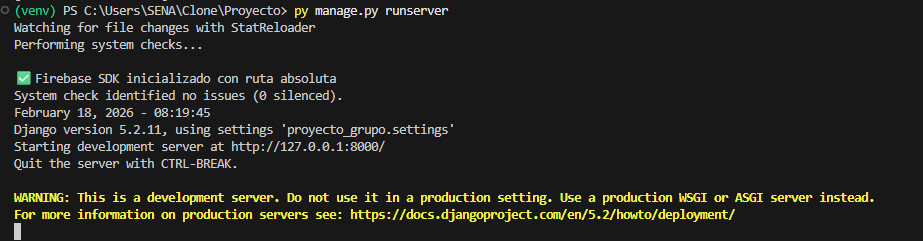

# Proyecto Django + Firebase
Este proyecto es una aplicacion básica de django que implementa diversos servicios de firebase, y que además esta desarrollado con un modelo MVT (Model-View-Template)acerca de un sistema de reservas de un hotel.

## Estructura del proyecto
Proyecto/
- proyecto_grupo
- reservas
- venv 
- manage.py

## Instrucciones intalación
Para probar el proyecto debes seguir los siguientes pasos:

## 1-Clonar el repositorio
   Primero desde la terminal o desde donde gustes crear  o selecciona una carpeta donde clonaremos el repositorio.

   <pre>    - mkdir Clone 
     - cd Clone</pre>

   
Luego de estar en la ruta seleccionada clonamos el repositorio

   <pre> git clone https://github.com/minostauro27-byte/Proyecto.git</pre>
   - Entramos al proyecto
   <pre> cd Proyecto </pre>
   - Creamos el entorno virtual
   <pre> py -m venv venv</pre>
   - Instalamos todas las librerias y datos necesarios especificados en el archivo requirements.txt por medio del comando: 
   <pre>pip install -r requirements.txt</pre>
   - Luego realizamos las migraciones por medio de:
   <pre> py manage.py makemigrations </pre>
   ---
    <pre>  py manage.py migrate  </pre>
   ---
   Luego simplemente levantamos elservidor con el comando
    <pre> py manage.py runserver </pre>

   Y para probar la aplicación solo deberas ir a la dirrección mostrada por el sistema.
   Ejemplo:

   
   

    

